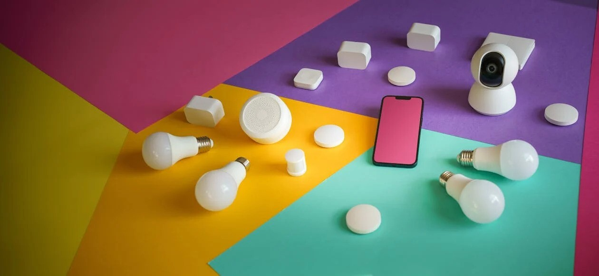
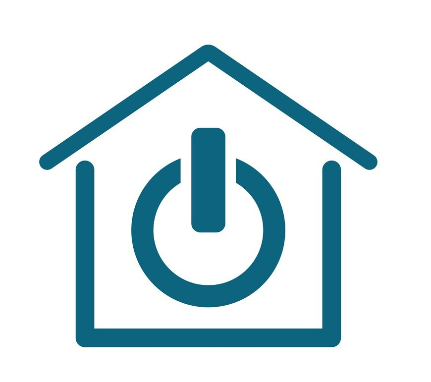

# assignment-1
I have a website using a smart home company website where a user can get product details and register himself to buy the project. The project has 4 documents namely 

## index 
Index pages contains the services provieded by the company, word from the founder and their product, company and contact details we have registration links in the page which will take us to contact page where you find registration from.

## contact 
Contact page has a form which contains feilds like name(text), email id(email), mobile num(number), plan details (drop down menu), adress (text), reuirments (textbox) and a submit button.

## thanks 
This is a simple page thanking the users for registration

## styles 
In this page we add styles to the html pages using text align, size and style background color, image, position, border radious, padding, margin to improve the user expirence of the nd user.

<!--- The images, audio, viedo resources and the website link are mentioned below  --->

<!--- The tags used in HTML are listed below --->

### Favicon: 
 this image is used as favicon using link tag

### Table: 
Table is used in features section of the  page which I used to show the different plans offered by the organisation.

### Form: 
Form is creaed in the  where we colllect the details from the user.

### Images: 
I have used many images using  tag and used images as Favicon, back ground and used some images in website. I had also used CSS features.

### Hyperlink: 
 has been used in the what are smart homes section of the website.

### Button:
Have placed 3 buttons in the whole website 2 in the index page and 1 in contact page using "hero-btn" class. Where 2 buttons in index will lead to contact page and button in contact leads to the thank you page.

### Audio:
An Audio has been placed in the "word from oue founder" section using <Audio> tag.

### Video:
A video has been placed in the "what are smart homes section of website" using <video> tag.

### Header:
Header has been used in the "header_sec" class of the website and the logo and the nav bar are placed in header.

### Footer:
A footer has been used in the "footer_about" class of the website and contact details, mail, mobile number have been placed in the footer.

### Summary:
A summary of the website has been placed in the website using 
 ans 
 tags and gives an overview of the website.

### Menu:
a <Menu> tag has been used in features we offer section which gives the features offerd the organisation.

### Tel for contact information:
Has been added in the footer section of the website using anchor tag and "mailto".

### Mailto for contact information:
Has been added in the footer section of the website using anchor tag and "tel".

